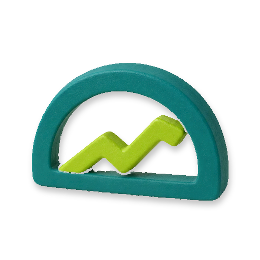

<p align="center">
  
</p>

# Hone

**Self-hosted performance telemetry for Laravel apps, queried by a coding agent instead of a dashboard.**

Hone collects the telemetry your Laravel apps already produce — slow requests, slow queries, job
durations, exceptions, cache hit rates — into a PostgreSQL database you run. Hone exposes that data
over [MCP](https://modelcontextprotocol.io) (Model Context Protocol: the standard an AI coding agent
uses to call an external tool), so an agent such as Claude Code can answer questions about your apps:

> **"What should we improve this week?"**

**What Hone includes.** Request, query, job and outgoing-HTTP timings rolled into daily aggregates;
exceptions; counts for cache, queue, mail, notification, scheduled-task, command and log activity;
comparison between deploys; and 19 read-only MCP tools over all of it.

**What Hone does not include.** No UI or dashboard. No alerting or paging. No distributed traces. No
raw request bodies. No long-term raw history: individual events are deleted after 72 hours by default
and only the daily aggregates are kept. No multi-tenancy — you run one Hone deployment per customer.
No sampling control; that stays in the source app's Nightwatch configuration.
[Laravel Nightwatch](https://github.com/laravel/nightwatch), Sentry and Datadog do include those
things.

**What it costs.** Hone is MIT licensed and charges nothing per event or per month. You pay for the
infrastructure you run it on: web compute, a PostgreSQL database, a Redis cache, a queue, and the disk
your telemetry occupies.

**Where the data goes.** Hone never forwards telemetry to a hosted monitoring service, Nightwatch's
included — it stays in your database. One boundary is yours to manage: MCP answers go to whichever
coding agent you connect, and those answers contain your telemetry (app names, routes, SQL shapes,
exception classes and locations, user ids). If that agent runs on someone else's servers, that is
where those answers go.

Hone is built on `laravel/nightwatch` (MIT, by Taylor Otwell). It replaces Nightwatch's ingest
transport so telemetry is posted to your Hone server instead. You do not need a Nightwatch
subscription, and Hone never contacts Nightwatch's cloud.

---

## The easy way: Scalpels

Running Hone yourself means forking this repository, provisioning a Laravel Cloud environment for it
(web compute, PostgreSQL, Redis, a queue and the scheduler), deploying it, connecting your apps, and
then keeping all of that current.

[**Scalpels**](https://scalpels.app/products/hone) does that for you: it forks Hone into your GitHub
organisation, provisions the resources in **your** Laravel Cloud account, deploys it, and keeps the app
and its migrations up to date. The repository and the infrastructure are yours either way. Scalpels
does the setup and the upkeep.

Everything below is the do-it-yourself path.

---

## How it fits together

```
  Your app #1 ─┐   hone-client replaces Nightwatch's transport,
  Your app #2 ─┼──▶ batches records, and POSTs them over HTTPS
  Your app #N ─┘
                   │
                   ▼
              POST /ingest      ← bearer credential; returns 202 and queues the batch
                   │
                   ▼
              queue ──▶ worker ──▶ PostgreSQL (raw_events)
                   │
                   ▼
              hourly hone:maintain ──▶ aggregates (daily rollups), then deletes old raw rows
                   │
                   ▼
              POST /mcp  ◀── your coding agent, with a different bearer credential
```

Three terms are worth defining before you start:

- **Envelope** — the small JSON wrapper each batch of telemetry travels in. It carries a version
  number, so an older app and a newer server can still talk to each other.
- **Credential purpose** — every bearer credential Hone issues is stamped with exactly one job. A
  `hone.ingest` credential may only send telemetry; a `hone.mcp` credential may only read it back over
  MCP. Presenting one where the other is required returns `401`. They are never interchangeable.
- **Installation ref** — the name you give a source app when you mint its ingest credential. Hone tags
  every record it stores with that name, so one Hone deployment can receive telemetry from many apps.

Hone is **single-tenant**: one deployment per customer, isolated by environment, serving as many of
that customer's apps as you like.

---

## Run it yourself

### Prerequisites

| You need | Notes |
| --- | --- |
| Git | To clone this repository. |
| PHP `^8.3` (8.3 through 8.x; CI runs 8.5) | `composer.json` requires `php: ^8.3`, so PHP 9 is out of range. |
| The `pdo_pgsql` PHP extension | Everything here talks to PostgreSQL. |
| The `redis` PHP extension | `.env.example` sets `REDIS_CLIENT=phpredis`. This repository does not require `predis/predis`, so the extension is the supported client. |
| Composer 2 | Installing dependencies. |
| A running PostgreSQL server | Telemetry uses `jsonb` columns and Postgres-only functions. MySQL and SQLite will not work. CI runs PostgreSQL 16. |
| A running Redis server | Backs the queue that processes accepted telemetry. |

Confirm the two PHP extensions are present:

```shell
php -m | grep -E '^(pdo_pgsql|redis)$'
```

Both names must print. If either is missing, add it to your PHP build before going on.

Confirm both services are up. How you start them depends on how you installed them — Homebrew
(`brew services start postgresql@16 redis`), Docker, or Laravel Herd's bundled services. Substitute
whichever PostgreSQL superuser your installation created for `postgres`:

```shell
psql -h 127.0.0.1 -p 5432 -U postgres -d postgres -c 'select version();'
redis-cli -h 127.0.0.1 -p 6379 ping
```

Expect a version string and `PONG`. (`pg_isready` is the more usual check, but some PostgreSQL
distributions — Laravel Herd's among them — ship `psql` without it.)

**About the `root` database role.** `.env.example`, `phpunit.xml` and
`packages/hone-server/tests/TestCase.php` all connect to `127.0.0.1:5432` as a role named **`root`**
with an empty password. The two test files are committed and hard-coded, so the test suites need that
exact role. Most PostgreSQL installations create a `postgres` superuser instead; if yours did, create
`root` once:

```shell
psql -h 127.0.0.1 -U postgres -d postgres -c "CREATE ROLE root WITH LOGIN SUPERUSER PASSWORD NULL;"
```

(You can point the *application* at a different user by editing `DB_USERNAME` and `DB_PASSWORD` in your
own `.env`, but the test configurations will still look for `root`.)

### Local development

**1. Get the code.** Clone this repository (or your fork of it) and change into it. Every later command
runs from this directory.

```shell
git clone https://github.com/artisan-build/hone.git
cd hone
```

**2. Install the dependencies.**

```shell
composer install
```

**3. Create your environment file and an application key.**

```shell
cp .env.example .env
php artisan key:generate
```

You should see `INFO  Application key set successfully.` If `APP_KEY` stays empty, later commands fail
with an encryption error.

**4. Create the databases.** `.env.example` points at a local database called `hone`, and the two test
suites use one each. Create all three:

```shell
psql -h 127.0.0.1 -U root -d postgres -c 'CREATE DATABASE hone;'
psql -h 127.0.0.1 -U root -d postgres -c 'CREATE DATABASE hone_app_test;'
psql -h 127.0.0.1 -U root -d postgres -c 'CREATE DATABASE hone_server_test;'
```

The test database names are fixed — `hone_app_test` in `phpunit.xml`, `hone_server_test` in
`packages/hone-server/tests/TestCase.php` — so use exactly those names.

**5. Run the migrations.**

```shell
php artisan migrate
```

These create two groups of tables in the same database: Hone's telemetry tables (`raw_events`,
`aggregates`, `samples`, `maintenance_markers`) and the credential and ownership tables that
[`artisan-build/built-for-cloud`](https://github.com/artisan-build/built-for-cloud) owns.

**6. Run the tests.** The app suite first:

```shell
composer test
```

That clears the config cache, checks formatting with Pint, and runs Pest against `hone_app_test`. Then
the telemetry package's own suite — `-d` runs Composer in that directory without moving your shell:

```shell
composer -d packages/hone-server install
composer -d packages/hone-server test
```

All of both should pass before you change anything.

**7. Start the app and check it answers.**

```shell
php artisan serve --host=127.0.0.1 --port=8787
```

Leave that running and use a second terminal for everything below.

```shell
curl http://127.0.0.1:8787/capabilities
```

You should see the envelope versions this build speaks:

```json
{"envelope":{"min_major":1,"max_major":1,"supported_majors":[1]}}
```

**8. Mint an ingest credential.** `installation` is the subject type, `local-demo` is the installation
ref (the app name Hone will tag records with), and `consumption` is the protocol purpose that
`hone.ingest` maps to:

```shell
php artisan bfc:credential:mint installation 'local-demo' --kind=bearer --purpose=consumption --name='hone-ingest-local-demo' --local
```

> **`--local` is required, and it means "the database of whatever machine this command is running
> on".** Run it on your laptop and it writes to your laptop's database; run it through
> `cloud command:run` and it writes to that Cloud environment's database. Without `--local` the command
> refuses and does nothing. See [Credentials](#credentials).

The credential is printed **once** and only its hash is stored. Put it in a curl configuration file
rather than passing it as a command argument, which would leave it in your shell history and in the
process table:

```shell
umask 077
printf 'Paste the credential: '
read -rs token
printf 'header = "Authorization: Bearer %s"\n' "$token" > ~/.hone-ingest.curl
unset token
```

`read -rs` does not echo what you paste, and `printf` is a shell builtin, so the value never becomes a
command argument. The file is created readable only by you.

**9. Send yourself a telemetry record.** Use the current time — Hone only aggregates recent events, so
a hard-coded date would be accepted and then quietly ignored by the rollup:

```shell
NOW=$(date -u +%Y-%m-%dT%H:%M:%SZ)
printf '{"envelope_version":1,"app":"checkout","deploy":"abc123","sent_at":"%s","records":[{"t":"request","timestamp":"%s","method":"GET","route":"/health","duration":124000}]}' "$NOW" "$NOW" > /tmp/hone-batch.json
curl -K ~/.hone-ingest.curl -H 'Content-Type: application/json' --data @/tmp/hone-batch.json http://127.0.0.1:8787/ingest
```

You should get `{"message":"Accepted."}`. Without the `-K` line you get
`{"message":"Unauthorized."}` and a `401`.

The record body is an opaque Nightwatch record; Hone only reads `t` (the record type) and a timestamp.
`duration` is Nightwatch's field and is in **microseconds**, so the `124000` above becomes 124 ms in
the aggregates.

**10. Drain the queue and look at the row.**

```shell
php artisan queue:work redis --once
psql -h 127.0.0.1 -U root -d hone -c 'select app, record_type, deploy, normalized_key, occurred_at from raw_events order by occurred_at desc limit 1;'
```

```
    app     | record_type | deploy | normalized_key |      occurred_at
------------+-------------+--------+----------------+------------------------
 local-demo | request     | abc123 | GET /health    | 2026-09-23 05:51:11+02
(1 row)
```

> **Note the app name.** The row says `local-demo`, **not** the `"app": "checkout"` you put in the
> envelope. The server always uses the credential's installation ref, so a source app cannot claim to
> be a different one.

**11. Roll the event up and check the instance is healthy.**

```shell
php artisan hone:rollup
php artisan hone:health
```

`hone:rollup` prints something like `Processed 1 groups from 2026-09-22; upserted 5 aggregate rows.`
That date is where the rollup window *starts* (`HONE_ROLLUP_LATE_ARRIVAL_HOURS` back from now, so
yesterday by default), not the day your event landed on.

`hone:health` then prints:

```
| Check               | Status | Detail                                                                       |
| maintenance         | ok     | {"last_success_at":null,"age_minutes":null,"budget_minutes":150}             |
| retention           | ok     | {"oldest_occurred_at":"...","age_hours":0,"budget_hours":96}                 |
| aggregate_freshness | ok     | {"newest_bucket_date":"...","age_hours":0,"budget_hours":6}                  |
```

It exits non-zero if any check alarms. A check reads `idle` rather than `ok` when no event has arrived
in the last hour — a quiet instance, not a broken one.

### Deploying to Laravel Cloud

> This section was written from
> [`.claude/skills/provisioning-hone-on-cloud/SKILL.md`](.claude/skills/provisioning-hone-on-cloud/SKILL.md)
> and its [`reference/`](.claude/skills/provisioning-hone-on-cloud/reference/) files, which record a
> real first run on `cloud` CLI v0.5.0. It was **not** re-executed when this README was last edited, so
> re-check any command that errors with `cloud <command> -h`. A skill-aware coding agent can run all of
> it for you if you ask it to *"provision a Hone instance on Laravel Cloud."*

You need the `cloud` CLI, authenticated (`cloud auth`, or `cloud auth:token --add` for a headless
machine). Every command below takes `-n` for non-interactive and `--json` where it reads or creates
something. `<...>` means a value you captured from an earlier command's JSON.

#### What you are creating

**Four resources, plus one flag**, in one Laravel Cloud environment per customer:

| Resource | Purpose |
| --- | --- |
| A web instance | Serves `/ingest` and `/mcp`. **Its scheduler flag must be on** — that is how `hone:maintain` and `hone:health` run; the scheduler is not a separate resource. |
| A PostgreSQL cluster with one database | Holds everything: credentials, raw events, aggregates. |
| A Redis cache | Backs the application cache. |
| A managed queue | Processes accepted ingest batches. Managed queues are SQS-backed, which is why this app requires `aws/aws-sdk-php`; a deploy fails without it. Do not provision a `background-process` worker instead. |

Sizing, from the skill's tier table — start small, because `:update` scales everything later. An
"event" is one telemetry record, roughly one `raw_events` row:

| Tier | Web instance | Redis | Rough capacity |
| --- | --- | --- | --- |
| Small | `flex-1gb`, 1 replica | `250mb` | 1–2 low-traffic apps, up to ~1M events/day |
| Medium | `flex-2gb`, 1–3 replicas | `1gb` | a few production apps, ~1–10M events/day |
| Large | `flex-4gb`+, 2–5 replicas | `2.5gb`+ | many or high-traffic apps, ~10M+ events/day |

Disk is the main cost driver: `events/day × (HONE_RETENTION_RAW_HOURS / 24) × ~1 KB`, so 10M events a
day at the default 72-hour retention is roughly 30 GB.

#### The sequence

**1. Fork this repository** into the GitHub organisation that owns the deployment, and connect that
organisation to Laravel Cloud if you have not already. Cloud deploys from a repository you control, not
from `artisan-build/hone`.

**2. Discover what is actually available**, and pick the region your source apps are already in so
ingest traffic stays local:

```shell
cloud app:list --json -n
cloud instance:sizes --json -n
cloud cache:types --json -n
```

**3. Create the application.** This also creates a default environment named `main`; reuse it rather
than creating a second one.

```shell
cloud application:create --name hone-<customer> --repository <your-org>/hone --region <region> --json -n
cloud application:get <app-id> --json -n
```

From that second response, record `defaultEnvironmentId` (call it `<env-id>` below) and the
environment's URL.

**4. Create the PostgreSQL cluster and its database.** The cluster is positional in the second command.
Neon serverless has no size flag — it scales by compute unit and suspends when idle.

```shell
cloud database-cluster:create --name hone-<customer> --type neon_serverless_postgres_18 --region <region> --json -n
cloud database:create <cluster-id> --name hone --json -n
```

**5. Create the Redis cache.** Both `--auto-upgrade-enabled` and `--is-public` are required; the CLI
rejects the call one flag at a time until you supply them.

```shell
cloud cache:create --name hone-<customer> --type upstash_redis --region <region> --size <redis-size> --auto-upgrade-enabled=false --is-public=false --json -n
```

**6. Create the managed queue.**

```shell
cloud managed-queue:create -n
```

**7. Size the web instance and turn its scheduler on.** `application:create` already made a default
instance. **`instance:create` is broken non-interactively on CLI v0.5.0**, so set the instance's size
in the Laravel Cloud dashboard (your application → the `main` environment → the web instance → size).
The scheduler flag *does* work from the CLI:

```shell
cloud instance:update <app-instance-id> --uses-scheduler=true --json -n --force
```

**8. Attach the database and the cache to the environment — in the dashboard.**
`environment:update --database-id` and `--cache-id` return success and silently do nothing on v0.5.0.
In the dashboard, open the environment and attach the PostgreSQL database (the schema named `hone`)
and the Redis cache. A private cache cannot be reached with manual connection variables, so this
attachment is required, not optional.

**⚠️ Now the one rule you must not break: never set an environment variable for a resource Laravel
Cloud provisions.** When you attach a database, cache, queue or bucket, Cloud injects its
configuration — both the credentials (`DB_HOST`, `REDIS_*`, `AWS_*`) **and** the connection selectors
(`DB_CONNECTION`, `CACHE_STORE`, `QUEUE_CONNECTION`, `FILESYSTEM_DISK`) — into a managed environment
file the app reads. Anything you set yourself shadows the injected value and breaks that resource.

This catches people in one specific place: `.env.example` sets `QUEUE_CONNECTION=redis` and
`HONE_QUEUE_CONNECTION=redis`, which is right locally and wrong on Cloud. **Copy neither into a Cloud
environment.** Cloud injects `QUEUE_CONNECTION` for the managed queue, and leaving
`HONE_QUEUE_CONNECTION` unset makes ingest batches use that injected default.

**9. Set the few variables that are genuinely yours.** `--action set` upserts one key and preserves the
rest, including the injected ones. Cloud generates `APP_KEY` itself.

```shell
cloud environment:variables <env-id> --action set --key APP_URL --value https://<env-url> -n --force
cloud environment:variables <env-id> --action set --key APP_ENV --value production -n --force
cloud environment:variables <env-id> --action set --key APP_DEBUG --value false -n --force
```

Everything in the [configuration tables](#configuration) already defaults to a sensible value, so set a
`HONE_*` key only to change one. Do **not** set `HONE_DB_*` — telemetry shares the database Cloud
attached. Do **not** set `NIGHTWATCH_TOKEN`.

**10. Deploy, and watch it finish.** The deploy runs the migrations for you.

```shell
cloud deploy hone-<customer> main --no-wait -n
cloud deployment:get <deployment-id> --json -n
```

Poll the second command until `status` reaches `deployment.succeeded`. It moves through
`build.running` → `deployment.running`; on `deployment.failed`, read `failureReason`.

**11. Mint the first ingest credential,** so you can verify the deployment end to end. The command runs
inside the environment, which is what `--local` means there:

```shell
cloud command:run <env-id> --cmd="php artisan bfc:credential:mint installation '<source-app-name>' --kind=bearer --purpose=consumption --name='hone-ingest-<source-app-name>' --local" -n
```

It prints the credential once. Capture it straight into the source app's secret environment.

**12. Verify functionally.** Do not use `environment:get` for this — it reports `databaseSchemaId`,
`cacheId` and `branch` as `null` even when they are set, so a null reading proves nothing.

```shell
curl -s -o /dev/null -w '%{http_code}\n' https://<env-url>/capabilities
```

- `/capabilities` → **200**.
- `POST /ingest` with no credential → **401**.
- `POST /ingest` with the credential from step 11 and an empty body → **422**. That is the one you
  want: authentication passed and only the envelope was rejected. A `401` here means the credential is
  missing, revoked, or has the wrong purpose or installation binding.
- `cloud command:run <env-id> --cmd="php artisan migrate:status" -n` lists the Hone tables.
- `POST /mcp` with no credential → **401**.

**Do not enable Laravel Cloud's built-in Nightwatch integration**, on this app or on your source apps.
It runs Cloud's managed agent and ships data to Nightwatch's hosted service, which is exactly what
Hone's transport replacement exists to avoid.

**What the scheduler runs.** `hone:maintain` hourly (roll raw events into daily aggregates, then delete
what is past retention) and `hone:health` hourly (check that maintenance is keeping up; exit non-zero
if it is not). **Nothing collects that exit code.** There is no monitor, alert or pager behind it — a
failing check is visible only to someone who reads the scheduler's Cloud logs. Hone is pull, not push,
and this is the honest consequence. To look at it on demand:

```shell
cloud command:run <env-id> --cmd="php artisan hone:health --json" -n
```

### Connecting a source app

Your source app must be a **Laravel 13** application on **PHP `^8.3`** — `hone-client` requires
`illuminate/contracts` and `illuminate/support` `^13.0` and `laravel/nightwatch` `^1.28`. On Laravel 11
or 12 the `composer require` below fails to resolve.

**1. On the Hone server,** mint that app an ingest credential. The installation ref you choose becomes
the app name in every Hone query. Skip this if you already did it in Cloud step 11.

```shell
php artisan bfc:credential:mint installation '<source-app-name>' --kind=bearer --purpose=consumption --name='hone-ingest-<source-app-name>' --local
```

For a deployed Hone instance, run the same command through the CLI so it acts on that environment's
database:

```shell
cloud command:run <env-id> --cmd="php artisan bfc:credential:mint installation '<source-app-name>' --kind=bearer --purpose=consumption --name='hone-ingest-<source-app-name>' --local" -n
```

The credential is shown once. Put it straight into the source app's secret environment — never into a
commit, a chat message or a ticket.

**2. In the source app,** install Nightwatch and the Hone client:

```shell
composer require laravel/nightwatch artisan-build/hone-client
php artisan hone:install
php artisan config:clear
```

Answer `hone:install`'s two prompts: the full Hone ingest URL, ending in `/ingest`, and then the
credential. **Use the prompt rather than the `--token=` option**: the prompt is hidden, while an option
puts the credential into your shell history and the process table. The installer writes `HONE_URL` and
`HONE_TOKEN` to `.env`, sets `NIGHTWATCH_ENABLED=true` if it is not already truthy, and pins
`artisan-build/hone-client` to a caret major constraint in `composer.json`. You do **not** need a
`NIGHTWATCH_TOKEN`.

Set `NIGHTWATCH_DEPLOY` in the **source app** at deploy time (the short commit SHA is the usual choice)
so Hone can compare one release against another:

```shell
echo "NIGHTWATCH_DEPLOY=$(git rev-parse --short HEAD)" >> .env
```

**3. Prove it is actually connected.** The client is deliberately fail-open — it never breaks your app,
and it never reports an error if it is inert — so a successful installer proves nothing on its own.

First confirm the Nightwatch transport really was replaced:

```shell
php artisan tinker --execute='echo get_class(app(\Laravel\Nightwatch\Core::class)->ingest), PHP_EOL;'
```

That must print `ArtisanBuild\HoneClient\HoneIngest`. If it prints a Nightwatch class instead, one of
`HONE_URL` or `HONE_TOKEN` is missing or the config cache is stale.

Then generate some telemetry and check the **server** received it:

```shell
php artisan about
```

Once the Hone deployment's queue worker has processed the batch, call the `ingest-freshness-tool` MCP
tool (see the next section). Your installation ref should appear with timestamps that advance:

```json
{"apps": [{"app": "<source-app-name>",
           "latest_occurred_at": "2026-09-23T05:45:00.000000Z",
           "latest_ingested_at": "2026-09-23T05:45:01.000000Z"}]}
```

> Using a coding agent in the source app? `hone-client` ships a `configuring-hone-client` skill at
> `vendor/artisan-build/hone-client/skills/configuring-hone-client/SKILL.md` once installed, and a
> longer integration guide at `vendor/artisan-build/hone-client/docs/integrate/default.md`. See also
> the [hone-client README](packages/hone-client/README.md#installation).

### Connecting a coding agent (MCP)

The MCP server is mounted at `HONE_MCP_PATH` (default `/mcp`) and requires an
`Authorization: Bearer <credential>` header.

Mint a **separate** credential for it. Like every credential command, this runs **on the Hone server**,
not in a source app — Built for Cloud is only installed here:

```shell
php artisan bfc:credential:mint installation '<source-app-name>' --kind=bearer --purpose=mcp --name='hone-mcp-<source-app-name>' --local
```

For a deployed instance:

```shell
cloud command:run <env-id> --cmd="php artisan bfc:credential:mint installation '<source-app-name>' --kind=bearer --purpose=mcp --name='hone-mcp-<source-app-name>' --local" -n
```

An ingest credential will not work here, and an MCP credential cannot send telemetry. Requests with no
valid credential get `401`. `GET /bfc/meta` needs no credential and reports the mounted path under
`endpoints.mcp`, along with the `mcp-serve` and `mcp-delegated` capabilities.

Hone also accepts a delegated assertion issued by Scalpels whose signed `purpose` claim is `mcp`. Hone
verifies those assertions but never issues them.

Point your agent at `https://<your-hone-host>/mcp` with that credential — most MCP clients take the
header from a configuration file rather than a command line. To check it by hand, keep the credential
out of your shell history the same way as before:

```shell
umask 077
printf 'Paste the MCP credential: '
read -rs token
printf 'header = "Authorization: Bearer %s"\n' "$token" > ~/.hone-mcp.curl
unset token
```

```shell
curl -K ~/.hone-mcp.curl -X POST https://<your-hone-host>/mcp \
  -H 'Content-Type: application/json' \
  -H 'Accept: application/json, text/event-stream' \
  -d '{"jsonrpc":"2.0","id":1,"method":"initialize","params":{"protocolVersion":"2025-06-18","capabilities":{},"clientInfo":{"name":"curl","version":"1"}}}'
```

A working server answers with `"serverInfo":{"name":"Hone","version":"1.0.0"}`.

---

## Using it

Hone exposes **19 read-only MCP tools**. Nothing writes, and every tool is classified as carrying
customer content, because even a count can be keyed by an app id, route, user id or deploy.

`tools/list` is paginated: the first page returns 15 tools and a `nextCursor`. If your client shows
only 15, it stopped at the first page.

| Group | Tools |
| --- | --- |
| Discovery | `list-apps-tool`, `record-types-tool`, `deploys-tool`, `ingest-freshness-tool` |
| Slow things | `slow_requests`, `slow_queries`, `slow_jobs`, `slow_outgoing_requests` |
| Analysis | `query_metric`, `regression_check`, `exceptions`, `top_users` |
| Volume and health | `cache_stats`, `queue_throughput`, `mail_volume`, `notification_volume`, `scheduled_task_health`, `command_stats`, `log_volume_by_level` |

In practice you ask your agent a question in English and it picks the tool. Calling one by hand looks
like this, reusing the curl configuration file from the previous section:

```shell
curl -K ~/.hone-mcp.curl -X POST https://<your-hone-host>/mcp \
  -H 'Content-Type: application/json' \
  -H 'Accept: application/json, text/event-stream' \
  -d '{"jsonrpc":"2.0","id":2,"method":"tools/call","params":{"name":"slow_requests","arguments":{}}}'
```

The result text is JSON: the window that was queried, an `offenders` list — each with a
`normalized_key` such as `GET /health`, a `count`, and `avg`/`max`/`p95`/`p99` in **milliseconds** —
and an `aggregate_freshness` block. That last one rides along on every aggregate-backed answer, so you
can tell "nothing is slow" apart from "the rollup has not run since Tuesday".

`p95` and `p99` are the worst daily percentile inside the window rather than a true percentile over it,
because percentiles cannot be averaged across days.

---

## Configuration

### The Hone server

Every key here is optional and every default below is what the code uses when the variable is unset.
These are tuning knobs, not setup requirements.

| Variable | Default | What it does |
| --- | --- | --- |
| `HONE_MCP_PATH` | `/mcp` | Where the MCP server is mounted. |
| `HONE_ROUTE_PREFIX` | *(none)* | URL prefix for `/ingest` and `/capabilities`. Does not affect the MCP path. |
| `HONE_QUEUE_CONNECTION` | *(none)* | Queue connection used for ingest batches. Unset means the app's default connection, which is what you want on Laravel Cloud. `.env.example` sets it to `redis` for local work. |
| `HONE_RETENTION_RAW_HOURS` | `72` | How long individual raw events are kept. |
| `HONE_RETENTION_AGGREGATE_DAYS` | `90` | How long daily aggregates are kept. |
| `HONE_RETENTION_SAMPLE_DAYS` | `7` | How long retained samples are kept. |
| `HONE_ROLLUP_LATE_ARRIVAL_HOURS` | `24` | How far back each hourly rollup re-reads, so an event that arrives late still gets aggregated. **The default is a guess, not a measurement** — size it from your own `created_at − occurred_at` spread. Older ranges are rebuilt with `hone:backfill`. |
| `HONE_MAINTENANCE_OVERLAP_LOCK_MINUTES` | `120` | Releases the `hone:maintain` overlap lock if a run dies without clearing it. |
| `HONE_HEALTH_INGEST_ACTIVE_MINUTES` | `60` | How recently an event must have arrived for the retention and freshness checks to judge at all. Outside this window they report `idle`, because a quiet instance is not an unhealthy one. |
| `HONE_HEALTH_MAINTENANCE_MAX_AGE_MINUTES` | `150` | Alarm if `hone:maintain` has not succeeded within this long. |
| `HONE_HEALTH_RETENTION_GRACE_HOURS` | `24` | Added to the raw retention window before the retention check alarms. |
| `HONE_HEALTH_AGGREGATE_MAX_AGE_HOURS` | `6` | Alarm if the newest aggregate bucket is older than this. |
| `BUILT_FOR_CLOUD_CREDENTIAL_GUARD` | `bfc` | The auth guard credentials resolve through. Leave it alone. |

`NIGHTWATCH_DEPLOY` is **not** a Hone server setting, despite the empty entry in `.env.example`.
Nothing on the server reads it; only `hone-client` does, in each monitored app. Setting it here records
nothing. See the source-app table below.

**Telemetry shares the application's own database by default.** With every `HONE_DB_*` variable unset,
Hone's `hone` connection is the application's default connection — fork, deploy, one PostgreSQL,
nothing to configure.

Setting **any** `HONE_DB_*` value switches Hone to a dedicated `hone` connection built by merging the
values you set over the application's connection; everything you leave unset is inherited. Whether
telemetry actually lands somewhere else therefore depends on *which* values you set:
`HONE_DB_DATABASE`, `HONE_DB_HOST` or `HONE_DB_URL` move it, while setting only `HONE_DB_USERNAME`,
`HONE_DB_PASSWORD` or `HONE_DB_PORT` leaves it addressing the same database through different
credentials — or fails to connect at all. One subtlety: unless you set `HONE_DB_URL` yourself, any
inherited connection URL is dropped, so the host and database values are the ones that take effect.
Both connections must be PostgreSQL.

On Laravel Cloud, `DB_*` is injected by Cloud, so you set none of it yourself.

### A source app

`HONE_URL` and `HONE_TOKEN` are **required together** to connect an app; the rest are optional with the
defaults shown.

| Variable | Default | What it does |
| --- | --- | --- |
| `HONE_URL` | *(none)* | **Required.** Your Hone server's ingest URL, ending in `/ingest`. |
| `HONE_TOKEN` | *(none)* | **Required.** The app's `hone.ingest` credential. |
| `HONE_APP` | `APP_NAME`, then `laravel` | The app identifier written into every envelope. Note that the server ignores it: stored rows are named from the credential's installation ref. It is transmitted, not authoritative. |
| `NIGHTWATCH_ENABLED` | Nightwatch's own default | Nightwatch's collection switch. `hone:install` sets it to `true` if it is not already truthy. |
| `NIGHTWATCH_DEPLOY` | *(none)* | The deploy identifier written into every envelope, usually a short commit SHA. This is the only place it does anything. |
| `HONE_BUFFER` | `500` | Records held in memory before the oldest are dropped. Hone drops rather than posting mid-request. |
| `HONE_CONNECT_TIMEOUT` | `0.5` | Connect timeout in seconds; values below `0.05` are clamped to `0.05`. |
| `HONE_TIMEOUT` | `0.5` | Request timeout in seconds; values below `0.05` are clamped to `0.05`. |

The client turns itself on when **both** `HONE_URL` and `HONE_TOKEN` are set — there is no separate
enable flag. Set exactly one of them and it stays inert and logs
`Hone is half-configured: set both HONE_URL and HONE_TOKEN, or neither.` A non-HTTPS `HONE_URL` logs a
warning and still sends, because the credential would travel in plaintext.

---

## Credentials

Credentials are managed by [`artisan-build/built-for-cloud`](https://github.com/artisan-build/built-for-cloud)
(v0.16.0 is the version this app locks). They live in a `credentials` table; bearer secrets are stored
as SHA-256 digests, so a lost credential is rotated, never recovered.

All of these commands **require `--local`**, which means "act directly on the database of the machine
running this command". They never reach out to Laravel Cloud on their own; to act on a deployed
environment, run them through `cloud command:run <env-id> --cmd "…" -n`.

```shell
php artisan bfc:credential:list --local
php artisan bfc:credential:rotate <id> --local
php artisan bfc:credential:revoke <id> --local
```

None of them accepts a secret as an argument — they only ever print one, once. `rotate` mints the
replacement before retiring the old one and gives bearer credentials a one-hour grace window, so you
can deploy the new value without dropping telemetry.

There is no environment-variable fallback on the server: if a credential is not in the table, the
request is refused.

---

## Compatibility and upgrades

With many independently-deployed source apps and one server you control, version skew is normal. The
envelope only ever grows within a major version — new fields are optional, existing ones are never
removed or repurposed — so a newer server parses every older envelope. The one dangerous direction is a
sender running ahead of the server, and that fails loudly with a `422` telling you to upgrade Hone.
Nightwatch's own record bodies are stored as opaque `jsonb`, so a change in their shape costs a rollup
a field and never breaks ingest.

**Always upgrade the Hone server first, run its migrations, then update the clients.** A source app can
check where it stands at any time:

```shell
php artisan hone:update
```

It reads `{HONE_URL}/capabilities` (stripping a trailing `/ingest`) and tells you whether your client's
envelope major is inside the server's supported range.

---

## Troubleshooting

**`401` on `/ingest` with a credential that should work.** The credential is missing, revoked, expired,
or has the wrong purpose. Only an `installation`-subject bearer credential whose purpose is
`consumption` is accepted. Check with `php artisan bfc:credential:list --local`.

**`401` on `/mcp` with the ingest credential.** Expected — purposes are not interchangeable. Mint a
second credential with `--purpose=mcp`.

**`422` on `/ingest`.** Authentication passed; the envelope did not. The body says why, for example
`Envelope is missing a numeric "envelope_version".` or `Envelope v2 is newer than this Hone server
(max v1). Upgrade your Hone app.`

**No telemetry arrives from a source app.** The client only activates when **both** `HONE_URL` and
`HONE_TOKEN` are set; with one missing it logs `Hone is half-configured…` and sends nothing. Confirm
the transport was replaced with the `tinker` check in step 3 of *Connecting a source app* — it must
print `ArtisanBuild\HoneClient\HoneIngest`. Run `php artisan config:clear` if you edited `.env` after
booting.

**`202` but no rows in `raw_events`.** The batch was accepted and queued. Something has to drain the
queue — a worker on the connection named by `HONE_QUEUE_CONNECTION`, or the app's default. Locally,
`php artisan queue:work redis --once` is the quickest way to confirm.

**Rows in `raw_events` but MCP tools return nothing.** Most tools read the daily aggregates, not raw
rows. Run `php artisan hone:rollup` (the scheduler does this hourly via `hone:maintain`), then check
`aggregate_freshness` in any tool's response. Note that the rollup only covers recent bucket days —
`HONE_ROLLUP_LATE_ARRIVAL_HOURS` back from now — so an event with an old timestamp is stored and never
aggregated. `hone:backfill` is how you pick those up.

**`hone:health` exits non-zero.** Read its table, or `php artisan hone:health --json`. `maintenance`
means the hourly run has stopped succeeding; `retention` means raw events are older than they should
be, which usually follows from the first; `aggregate_freshness` means the newest daily bucket is stale.
A status of `idle` is not a failure — it means no event has arrived in the last
`HONE_HEALTH_INGEST_ACTIVE_MINUTES`, so those checks are not judging.

**A gap in aggregates after an outage.** `php artisan hone:backfill <from> <to>` rebuilds an explicit
UTC date range one day at a time and resumes from its own checkpoint. `--restart` ignores the
checkpoint and starts the range again.

**The app name in Hone is wrong.** It comes from the credential's installation ref, not from the source
app's `HONE_APP`. Mint a new credential with the ref you want.

**Tests fail to connect.** The suites use fixed settings on `127.0.0.1:5432` as user `root` with an
empty password: `hone_app_test` for the app suite, `hone_server_test` for the `hone-server` package
suite. See *Prerequisites* about creating that role.

---

## Repository layout

This is a monorepo. Three packages live under `packages/` and are split read-only to their own
repositories and published to Packagist:

| Package | Installed in | Role |
| --- | --- | --- |
| [`artisan-build/hone-contracts`](https://github.com/artisan-build/hone-contracts) | both packages | The versioned wire envelope. The one place compatibility lives. |
| [`artisan-build/hone-client`](https://github.com/artisan-build/hone-client) | your monitored apps | The send side: transport replacement, batching, POST, install and update commands. |
| [`artisan-build/hone-server`](https://github.com/artisan-build/hone-server) | the Hone app | The receive side: ingest, storage, rollups, prune, MCP server. |

The Hone app at this repository's root is a slim Laravel shell that wires `hone-server` together with
Built for Cloud's credential handling. There is deliberately no Hone-specific business logic in it.

**Contributing.** Issues and pull requests are disabled on the three split repositories, the same way
Laravel's own `illuminate/*` splits work. All development happens here. See
[`SECURITY.md`](SECURITY.md) for private vulnerability disclosure — Hone sits on an ingest path.

Hone is written for how [Artisan Build](https://artisan.build) uses it. Bugs get fixed.
Customer-specific features stay in customer forks and are not backfilled into the open-source release.

---

## Privacy

Hone is meant to be safe to hand to an LLM when your source apps use Nightwatch's normal redaction
configuration, which runs **before** anything is sent to Hone. Query bindings are not part of Hone's
normalized query key and Hone adds no second capture path for them. MCP tools summarise by normalized
keys — route, SQL shape, exception class and location, log level, user id, cache `store:type` — rather
than returning raw request bodies or arbitrary event payloads. What those summaries do contain still
leaves your infrastructure if the agent you connect is hosted elsewhere; see *Where the data goes*
above.

## License

Hone is open-source software licensed under the [MIT license](LICENSE).
